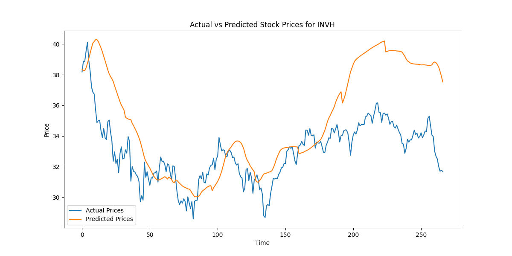

# Stock Price Prediction with LSTM-Transformer Hybrid Model and XGBoost Ensemble

This project aims to predict stock prices using a hybrid model that combines Long Short-Term Memory (LSTM) and Transformer models for capturing both short-term and long-term dependencies. Additionally, an ensemble method using XGBoost is applied to improve the final predictions by leveraging the outputs from the Transformer model and combining them with original features.

## Project Overview

- **Model**: LSTM-Transformer Hybrid
- **Ensemble**: XGBoost ensemble on top of Transformer predictions
- **Technologies**: PyTorch, scikit-learn, XGBoost, Yahoo Finance, and BERT for sentiment analysis

### Key Features:
- **Sentiment Analysis**: News sentiment is derived using BERT and incorporated into the model as a feature.
- **Hybrid LSTM-Transformer Model**: The model captures both short-term and long-term dependencies.
- **XGBoost Ensemble**: XGBoost takes Transformer predictions along with original features to improve the final prediction.
- **Technical Indicators**: Several technical indicators such as RSI, MACD, and Bollinger Bands are used as features.
- **Support for Multiple Stocks**: The model can be trained and evaluated for multiple stocks from the S&P 500.

## Directory Structure

```bash
project/
│
├── data/
│   └── fetch_data.py              # Data fetching and preprocessing functions
├── features/
│   └── feature_engineering.py      # Feature engineering functions (technical indicators, sentiment analysis, etc.)
├── models/
│   ├── lstm_transformer_hybrid.py  # LSTM-Transformer Hybrid model
│   ├── ensemble_model.py           # XGBoost ensemble model
│   └── train_model.py              # Training and evaluation functions
├── utils/
│   ├── helpers.py                  # Helper functions (sequence creation, plotting, etc.)
│   └── __init__.py
├── scripts/
│   └── main.py                     # Main script to run the project
├── requirements.txt                # Required libraries
└── README.md                       # This file
```

## Setup Instructions

### Prerequisites

1. **Python 3.7+**
2. **Virtual Environment** (Recommended)
3. **Required Libraries**: All required libraries are listed in `requirements.txt`.

### Install Dependencies

1. Clone the repository:
    ```bash
    git clone https://github.com/VanshK123/StockPredictor.git
    cd StockPredictor
    ```

2. Create a virtual environment and activate it:
    ```bash
    python3 -m venv venv
    source venv/bin/activate  # On Windows: venv\Scripts\activate
    ```

3. Install the required dependencies:
    ```bash
    pip install -r requirements.txt
    ```

### Set Up Environment Variables

1. Create a `.env` file and add your `NEWSAPI_KEY` to it for fetching sentiment analysis data:
    ```
    NEWSAPI_KEY=your_news_api_key_here
    ```

### Running the Project

To run the stock price prediction for multiple S&P 500 companies:

```bash
python scripts/main.py
```

You will be prompted to enter the number of S&P 500 companies to process and the number of epochs for model training.

### How to Run the Project

1. Activate the virtual environment:

```bash
source venv/bin/activate
```

2. Run the main script:

```bash
python scripts/main.py
```

3. **Input the Number of Companies**: The program will prompt you to enter how many S&P 500 companies you want to process (e.g., 3):

```bash
Enter the number of S&P 500 companies to process: 3
```

4. **Input the Number of Epochs**: You will also be prompted to enter the number of epochs to use for training the model (e.g., 20):

```bash
Enter the number of epochs for model training: 20
```

The program will then fetch stock data for the selected companies, preprocess it, train a Transformer-based model, and output the stock price predictions along with plots showing actual vs. predicted prices.

---

## Model Workflow

1. **Data Fetching**: 
   - The project fetches stock data using Yahoo Finance and applies technical indicators (RSI, MACD, Bollinger Bands).
   - Sentiment analysis is performed on stock-related news headlines using BERT.

2. **LSTM-Transformer Hybrid Model**: 
   - The data is passed through a hybrid model consisting of LSTM and Transformer layers.
   - LSTM captures short-term dependencies, while the Transformer captures long-term dependencies.

3. **XGBoost Ensemble**: 
   - The predictions from the Transformer model are used as additional features to train an XGBoost model.
   - This ensemble method leverages both the Transformer predictions and the original stock features for improved accuracy.

4. **Evaluation and Plotting**: 
   - The final predictions are evaluated using RMSE, and the predicted vs. actual stock prices are plotted.

---

## Sample Output

Here is a sample output graph showing the actual vs. predicted stock prices for a stock with 50 epochs and batch size of 32:



## Key Changes and Features

1. **Sentiment Analysis Using BERT**: 
   - Replaced TextBlob with a BERT-based sentiment analysis for more nuanced sentiment extraction from stock-related news.
   
2. **LSTM-Transformer Hybrid Model**: 
   - Implemented a hybrid model that combines LSTM (for short-term dependencies) with Transformer (for long-term dependencies).
   
3. **Volume-Based Indicators**: 
   - Added technical indicators such as On-Balance Volume (OBV), Accumulation/Distribution Index (ADI), and Chaikin Money Flow (CMF).
   
4. **XGBoost Ensemble**: 
   - Combined the Transformer model predictions with original stock features using XGBoost to create an ensemble model.
   - Placeholder values (e.g., zeros) are used for training data where Transformer predictions are unavailable.

5. **Handling Feature Shape Mismatches**: 
   - During the XGBoost training and evaluation phase, we ensure that the number of features matches by adding placeholder values for the training set and concatenating the Transformer predictions with the test set.

## Improvements and Next Steps

1. **Enhance Feature Engineering**: Experiment with additional technical indicators and financial metrics to further improve the model's accuracy.
2. **Hyperparameter Tuning**: Adjust the hyperparameters of both the LSTM-Transformer Hybrid model and the XGBoost ensemble to optimize performance.
3. **Real-Time Predictions**: Extend the project to handle real-time data for more accurate and dynamic stock price predictions.

---

## Conclusion

This project showcases a hybrid deep learning approach that combines LSTM and Transformer models to predict stock prices, while leveraging XGBoost as an ensemble layer to improve final predictions. The architecture is designed to handle multiple stocks from the S&P 500 index and integrates technical indicators, sentiment analysis, and ensemble methods for enhanced performance.

---
